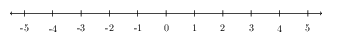

# Numbers

> **Status:** DRAFT

> **Vesrion:** 0.1

Numbers are the language of the universe, shaping everything from simple
counting to complex scientific discoveries. They help us measure, calculate, and
recognize patterns, making sense of the world in ways we often take for
granted—whether in technology, nature, or even everyday decisions.

The journey of numbers is as fascinating as their applications. Early humans
used tally marks to keep track of things, while ancient civilizations like the
Mesopotamians and Egyptians developed numeral systems that laid the groundwork
for modern mathematics. The invention of zero in India changed the way we
calculate, and negative numbers—once dismissed as nonsense in Europe—eventually
found their place in math. The Greeks wrestled with the mystery of irrational
numbers, and complex numbers, once thought to be purely imaginary, now play a
key role in engineering and physics. From ancient tools to cutting-edge
technology, numbers have shaped human progress, and their story is still being
written.

In simple words, a number is a fundamental concept that represents a quantity,
count, or measurement. Numbers are used to perform arithmetic operations such as
addition, subtraction, multiplication, and division. There are different types of numbers including Natural Numbers, Integers, Rational Numbers, Irrational Numbers, and Real Numbers.

## Natural Numbers ($` \mathbb{N} `$)

Natural numbers are the set of positive numbers used for counting and ordering,
and it's denoted with the $` \mathbb{N} `$ symbol. In primary schools, natural
numbers are also called as counting numbers. Because it's used for counting
things. As you can guess, the counting numbers are:

$$ \mathbb{N} = \{ 1,2,3,4,\ldots \} $$

Note: The above notation used to represent natural numbers are called set theory
notation.

Some books include $` 0 `$ also into the natural numbers. But there is a
different word for that, whole numbers. So, whole numbers are natural numnbers
with $` 0 `$. The commonly used notations are $` \mathbb{W} `$, and $`
\mathbb{N}_0 `$. Using the set theory notation, we can write: $` \mathbb{N}_0 =
\mathbb{N} \cup {0} `$

## Integers ($` \mathbb{Z} `$)

Integers include whole numbers and negative numbers.

$$ \mathbb{Z} = \ldots,−3,−2,−2,0,1,2,3,\ldots $$

Number line would be a good mental model to understand integers:

Integers can be defined using the set notation like this:

$$
\mathbb{Z} = \{ \ldots, -3, -2, -1, 0, 1, 2, 3, \ldots \}
$$

### Subsets of $` \mathbb{Z} `$

- **Positive integers:**

$$
  \mathbb{Z}^+ = \{ 1, 2, 3, 4, \ldots \}
$$

- **Negative integers:**

$$
\mathbb{Z}^- = \{ -1, -2, -3, -4, \ldots \}
$$

- **Non-negative integers:**

$$
\mathbb{Z}_{\ge 0} = \{ 0, 1, 2, 3, \ldots \}
$$

- **Non-positive integers:**

$$
\mathbb{Z}_{\le 0} = \{ \ldots, -3, -2, -1, 0 \}
$$

## Rational Numbers ($` \mathbb{Q} `$)

A rational number is any number that can be expressed as a fraction $` q/p `$​,
where $` p `$ and $` q `$ are integers and $` q=0 `$. Here, $` p `$ is called
the numerator and $` q `$ is the denominator. All integers are rational numbers
because any integer $` a `$ can be written as $` a/1 `$.

Examples: $` 21​,−43​,7,0.5 `$

Rational numbers can also be defined in terms of decimal points based on the
behavior of their decimal expansions. A number is rational if and only if its
decimal expansion is either terminating or repeating (recurring).

Here's what that means:

1. Terminating Decimal:

A rational number has a finite number of digits after the decimal point.

Example:

$$
\frac{1}{2} = 0.5
$$
$$
\frac{3}{4} = 0.75
$$

2. Repeating Decimal:

A rational number has an infinite decimal expansion that eventually repeats a pattern.

Example:
$$
\frac{1}{3} = 0.\overline{3}
$$
$$
\frac{2}{11} = 0.\overline{18}
$$
$$
\frac{1}{12} = 0.08\overline{3}
$$
$$
\frac{1}{7} = 0.\overline{142857}
$$

Rational number can be defined using the set notation like this:
$$
\mathbb{Q} = \left\{ \frac{p}{q} \;\middle|\; p \in \mathbb{Z},\; q \in \mathbb{Z} \setminus \{0\} \right\}
$$

## Irrational Numbers ( $` \mathbb{R}\backslash\mathbb{Q} `$)

Rational numbers are numbers that cannot be written as a fraction. That is, it cannot be written in the form:

$$
\frac{p}{q}, \quad \text{where } p, q \in \mathbb{Z},\; q \ne 0
$$

Irrational numbers can also be defined in terms of decimal points based on the
behavior of their decimal expansions. If a number has a decimal expansion that
neither ends nor repeats, it is irrational.

Examples: $` \pi,\sqrt{2},e `$

## Real Numbers ($` \mathbb{R} `$)

Real numbers are all rational and irrational numbers combined.

$$
\mathbb{R} = \mathbb{Q} \cup (\mathbb{R} \setminus \mathbb{Q})
$$

Real numbers fill the entire number line -- there's no gap between any two real
numbers. Between any two real numbers, there are infinitely many others.

## Complex Numbers ($` \mathbb{C} `$)

Numbers that include the imaginary unit $` i `$, where $` i^2 = −1 `$

Example: $` 3+2i `$

## Other Type of Numbers

There are other special types of numbers, a couple of them are given here:

### Prime Numbers

Natural numbers greater than 1 that have only two factors: $` 1 `$ and itself.

Example: $` 2,3,5,7,11,13,\ldots `$

### Composite Numbers

Natural numbers that have more than two factors.

Example: $` 4,6,8,9,10 `$ (since they can be factored further)
